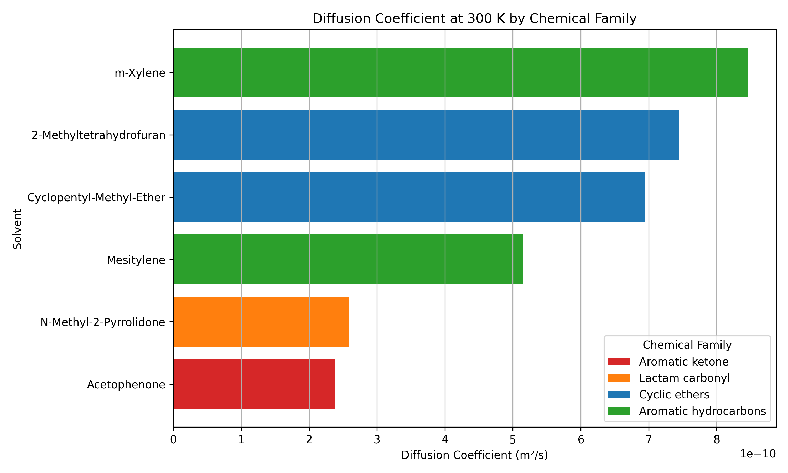
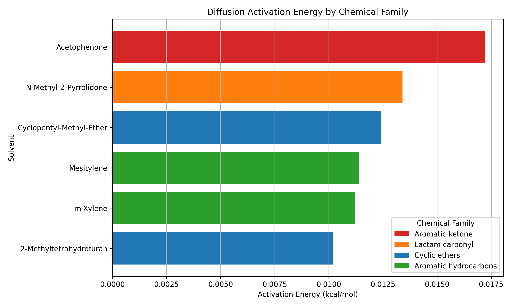
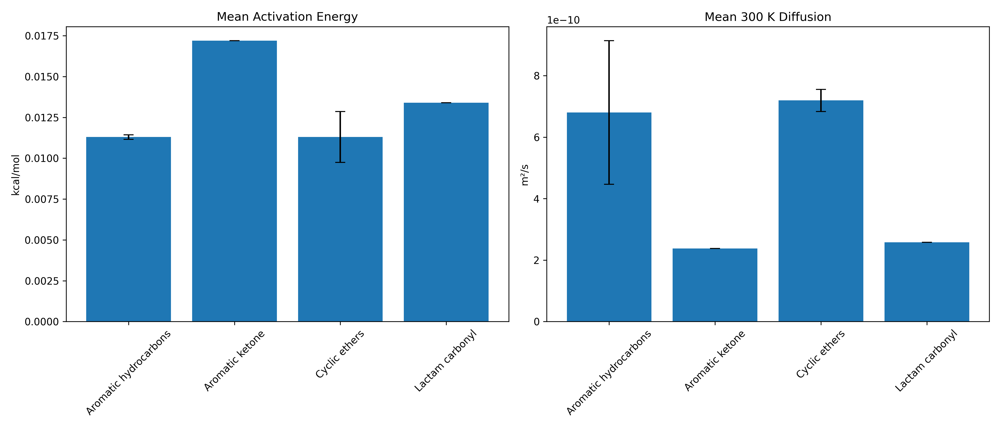
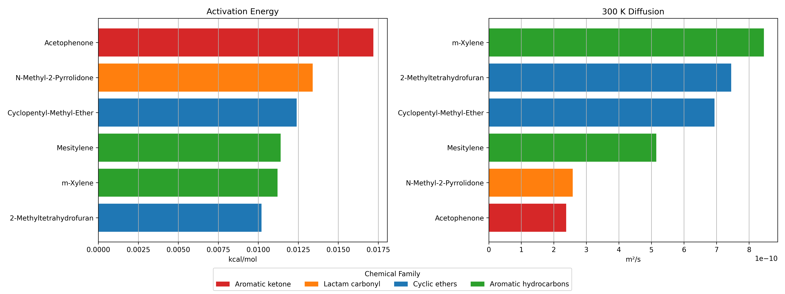
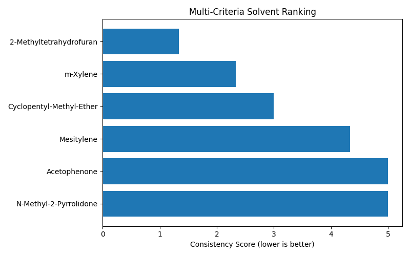

# Diffusion Coefficients of Green Solvents by Molecular Dynamics

Computational investigation of self-diffusion in green organic solvents using molecular dynamics simulations and statistical mechanics.

---

## Overview

This project focuses on the calculation of **self-diffusion coefficients** of organic green solvents based on molecular center-of-mass motion.

The methodology combines:

* Molecular Dynamics simulations
* Statistical mechanics
* Numerical data analysis

The work originates from a diploma thesis and is structured into a reproducible computational workflow.

---

## Physical Background

Diffusion is quantified through the **Mean Squared Displacement (MSD)**:

D = lim (t → ∞) [ 1 / (6t) ] ⟨ |r(t) − r(0)|² ⟩

Where:

* D: self-diffusion coefficient
* r(t): center-of-mass position
* MSD is evaluated in the diffusive (Fickian) regime

The diffusion coefficient is obtained from the **slope of MSD vs time**.

---

## Simulation Methodology

### Molecular Dynamics Setup

* Force field: **AMBER**
* Simulation engine: NAMD
* Trajectory analysis: VMD

### Simulation Parameters

* Time step: 1 fs
* Equilibration: 100,000 – 150,000 steps
* Production runs: up to 4,000,000 – 5,000,000 steps
* Trajectory sampling: every 10 steps

---

## Research Strategy

### 1. Method Validation

Simulations were first performed on reference solvents:

* Ethanol
* Acetone
* Acetic acid
* N-Methylacetamide (NMA)
* Pyridine

**Objective:**

* Validate stability of thermodynamic properties
* Verify reliability of MD methodology

---

### 2. Green Solvent Study

Six green solvents were investigated:

#### Aromatic solvents

* m-Xylene (MXY)
* Mesitylene (MS)
* Acetophenone (AP)

#### Non-aromatic solvents

* 2-Methyltetrahydrofuran (2-MTHF)
* N-Methyl-2-pyrrolidone (NMP)
* Cyclopentyl methyl ether (CME)

**Objective:**

* Compare aromatic vs non-aromatic behavior
* Investigate structural effects on diffusion

---

## Temperature Dependence

* Base simulations at **300 K**
* Additional simulations across temperature range

Used to extract:

* Activation energy of diffusion
* Pre-exponential diffusion factor

---

## Results

### Diffusion Behavior

* Diffusion coefficients were successfully calculated for all systems
* MSD curves exhibited clear linear regions (Fickian regime)
* Reliable slopes enabled consistent D estimation

### Structural Effects

* Aromatic solvents showed **reduced mobility**

  * due to rigid ring structures
  * increased steric hindrance

* Non-aromatic solvents showed:

  * higher flexibility
  * enhanced diffusion

### Temperature Effects

* Diffusion increased with temperature (expected behavior)
* Arrhenius behavior observed across all solvents

### Activation Energy

* Moderate variation between solvents
* Indicates similar diffusion mechanisms with structural dependence

---

## Plots and Data Visualization

The repository includes key plots for analysis:

### 1. Mean Squared Displacement (MSD)

* MSD vs time for each solvent
* Linear region used for diffusion coefficient extraction

### 2. Diffusion Coefficient Comparison

* Bar plots comparing all solvents
* Clear distinction between aromatic and non-aromatic systems

### 3. Arrhenius Plot

* ln(D) vs 1/T
* Linear fitting used to extract activation energy

### 4. Energy and Stability Plots

* Temperature vs simulation steps
* Potential energy vs time
* Box size convergence

---

## Data and Availability

The repository contains:

* Processed diffusion data
* Analysis scripts
* Plotting scripts
* Database structure

⚠️ Note:
Raw MD trajectories are not included due to large size and are stored on laboratory systems.

---

## Key Results and Visualizations

### Diffusion Coefficients at 300 K

Clear separation is observed between solvent classes, with cyclic ethers exhibiting higher mobility compared to carbonyl-containing systems.

---

### Activation Energy of Diffusion

Activation energy values indicate moderate variation across solvents, suggesting similar diffusion mechanisms with structural dependence.

---

### Transport Behavior by Chemical Family

Cyclic ethers display consistent transport properties, while aromatic hydrocarbons show higher variability due to steric effects.

---

### Multi-Metric Transport Analysis

Combined visualization of diffusion, activation energy, and thermal response highlights the multi-factor nature of transport behavior.

---

### Rank Consistency Analysis

### Rank Consistency Table

| Solvent                  | Diffusion Rank | Thermal Rank | Barrier Rank | Consistency Score |
| ------------------------ | -------------- | ------------ | ------------ | ----------------- |
| 2-Methyltetrahydrofuran  | 2              | 1            | 1            | 1.33              |
| m-Xylene                 | 1              | 4            | 2            | 2.33              |
| Cyclopentyl-Methyl-Ether | 3              | 2            | 4            | 3.00              |
| Mesitylene               | 4              | 6            | 3            | 4.33              |
| Acetophenone             | 6              | 3            | 6            | 5.00              |
| N-Methyl-2-Pyrrolidone   | 5              | 5            | 5            | 5.00              |

Lower consistency score indicates better overall performance across all transport metrics.

Multi-criteria ranking identifies 2-Methyltetrahydrofuran as the most balanced solvent across all transport descriptors.

## Limitations

* Absolute diffusion values may deviate from experimental data
* Force field limitations affect accuracy
* Finite simulation time introduces statistical uncertainty

---

## Tools and Technologies

* Molecular Dynamics: NAMD
* Visualization: VMD
* Force Field: AMBER
* Data Analysis: Python (NumPy, pandas)
* Plotting: matplotlib
* Database: SQLite

---

## Project Status

✔ Methodology validated

✔ Diffusion coefficients computed

✔ Temperature dependence analyzed

✔ Scientific workflow established

---

## Thesis
The full diploma thesis (in Greek) is available in the `docs/` folder.

---

## Author

Athanasios Papagiannis

Department of Materials Science and Engineering

University of Ioannina
